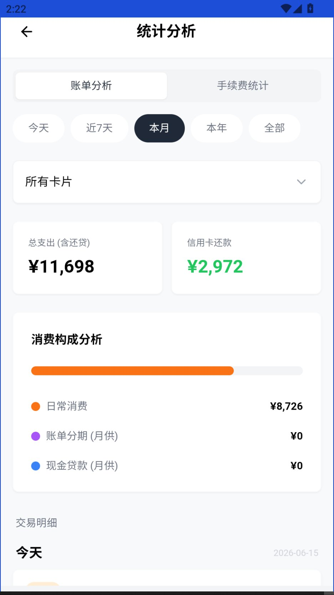

# 💳 信用卡管家

一款专为持有多张信用卡的用户设计的 Android 账单管理应用。支持多卡管理、消费追踪、手续费核算、分期计划、数据可视化等功能，所有数据本地存储，保障隐私安全。

## ✨ 核心功能

### 📋 多卡管理

- 添加/编辑/删除信用卡，预设 **20家主流银行**（招商、工商、建设、农业、中国、交通、平安、中信、光大、浦发、民生、兴业、广发、邮储、华夏等）
- 每张卡独立配置：持卡人、卡号后四位、固定额度、临时额度及有效期
- 自动匹配银行主题色（招行红、建行蓝、农行绿等），卡片视觉鲜明易区分
- 支持批量选择和删除，可按还款日/额度/未还金额排序
- 首页全局统计：总额度、已用额度、可用额度、可用比例、逾期卡片数

### 💰 账单周期

- 支持两种还款配置：
  - **固定日还款** — 每月固定日期还款（如每月10号）
  - **账单日后N天** — 账单日往后推N天还款（如账单日后20天）
- 自动计算当前账单周期（已出账/未出账）
- 账单日到期自动结转：未出账金额 → 已出账金额，重新计算还款日
- 跨年、跨月、月末边界（如1月31日账单日→2月28日）正确处理
- 每笔交易根据日期自动归入对应账单周期，无需手动分类

### 💸 交易记录

支持四种交易类型：

| 类型 | 说明 | 对余额影响 |
|---|---|---|
| `consumption` | 普通消费 | 增加未还/未出账 |
| `repayment` | 还款 | 减少未还款项 |
| `loan_bill` | 贷款账单 | 增加未还款项 |
| `installment_start` | 分期起始 | 由分期模块自动生成 |

- 每笔消费可记录：金额、渠道、商户类型、手续费、实际到账金额、POS机编号、备注
- 支持编辑/删除已有交易，自动回溯调整余额
- 交易按账单周期分组展示，清晰区分"当期未还"、"历史已出账"、"未出账单"

### 🏧 POS 机费率管理

- 预设 4 种 POS 机类型：
  - 标准费率POS（0.60%）— 支持刷卡/插卡/闪付子渠道
  - 优惠费率POS（0.55% + 3元/笔）— 支持支付宝/微信子渠道
  - 大额专用POS（0.50%）
  - 线上快捷支付（0.38%）
- 每个 POS 机可配置多个子渠道，各自独立费率
- 支持自定义添加/编辑/删除 POS 机和渠道
- 录入消费时自动匹配 POS 机和渠道，实时计算手续费和实际到账金额

### 📊 数据统计与分析

**消费分析**（按天/周/月/年/全部）：
- 消费趋势折线图、银行消费占比饼图
- 按卡片/银行的消费排行
- 日均消费、交易笔数等关键指标

**手续费统计**（本月/近3月/今年/自定义）：
- 按 POS 机、渠道汇总手续费
- 费率对比分析
- 支持导出 CSV 报表

### 📅 分期计划

- 支持等额本息分期计算，可选期数：**3 / 6 / 9 / 12 / 18 / 24 / 36 期**
- 输入本金和年化利率，自动计算：
  - 每期月供（本金 + 利息）
  - 每期还款明细（本金、利息、剩余本金）
  - 每期还款日（对齐账单日）
  - 总利息、总还款额
- 自动在账单中生成分期起始交易和每月还款交易
- **提前结清计算**：根据剩余本金、逾期利息、利息减免，计算结清金额
- 分期状态追踪：进行中 / 已结清

### ⏰ 还款提醒

- 基于 Capacitor Local Notifications 的本地通知
- 还款日前自动提醒，逾期卡片特别标注
- 支持 Web 端 Notification API（开发调试用）
- 可开关通知功能

### 💾 数据安全

- **SQLite 本地数据库**：基于 `@capacitor-community/sqlite`，所有数据存于设备本地
- **零网络传输**：无后端、无云同步，数据完全离线
- **自动备份**：每次保存自动生成备份快照（保留最近5份），防止误操作数据丢失
- **JSON 导出/导入**：支持将全部数据（卡片、交易、POS机、分期计划）导出为 JSON 文件，可跨设备迁移
- **Zod 数据校验**：导入数据时进行严格的 Schema 校验，防止数据污染
- **操作日志**：记录所有关键操作（增删改），支持查看和排查

### 🎮 交互体验

- 左滑手势返回（从屏幕左侧边缘右滑）
- 启动屏 Logo 动画
- 批量选择模式，支持多卡同时删除
- 下拉刷新、确认弹窗等完善交互

## 🛠 技术栈

| 类别 | 技术 |
|---|---|
| 前端框架 | React 18 + TypeScript 5.6 |
| 构建工具 | Vite 6 |
| 状态管理 | Zustand 5 |
| UI 样式 | TailwindCSS 3.4 |
| 图标库 | Lucide React |
| 本地数据库 | `@capacitor-community/sqlite` 8 |
| 原生运行时 | Capacitor 8 |
| 原生插件 | StatusBar, LocalNotifications, Filesystem, Share, App |
| 数据校验 | Zod 3 |
| 测试框架 | Vitest 3 + jsdom |

## 🚀 快速开始

### 环境要求

- Node.js ≥ 18
- npm ≥ 9
- Android Studio（用于构建 APK）
- Capacitor CLI

### 本地开发

```bash
# 克隆项目
git clone https://github.com/davidwil11111/credit-card-manager.git
cd credit-card-manager

# 安装依赖
npm install

# 启动 Web 开发服务器（浏览器预览）
npm run dev

# 运行单元测试
npm test

# 类型检查 + 构建
npm run build
```

### Android 构建

```bash
# 构建前端
npm run build

# 同步到 Android 项目
npx cap sync

# 用 Android Studio 打开
npx cap open android
```

然后在 Android Studio 中 Build → Build Bundle(s) / APK(s)。

## 📁 项目结构

```
credit-card-manager/
├── App.tsx                          # 应用根组件（路由、手势、弹窗管理）
├── index.tsx                        # ReactDOM 入口，Capacitor StatusBar 初始化
├── store.ts                         # Zustand 全局状态（卡片/交易/POS/分期 CRUD）
├── types.ts                         # 所有 TypeScript 类型定义
├── constants.ts                     # 银行主题色、POS 预设、Mock 数据、re-export 计算函数
│
├── components/
│   ├── Overview.tsx                 # 🏠 首页 — 卡片列表、全局统计、排序、批量操作
│   ├── Detail.tsx                   # 📋 卡片详情 — 账单周期视图、交易列表、分期入口
│   ├── CreditCardForm.tsx           # ✏️ 卡片表单 — 添加/编辑信用卡
│   ├── TransactionForm.tsx          # 💳 交易表单 — 添加/编辑交易，POS/费率联动
│   ├── Statistics.tsx               # 📊 统计总页 — 消费分析 + 手续费统计（Tab切换）
│   ├── Analysis.tsx                 # 📈 消费分析 — 趋势图、银行占比、排行榜
│   ├── FeeStatistics.tsx            # 💰 手续费统计 — POS/渠道汇总、费率分析、导出
│   ├── InstallmentForm.tsx          # 📅 分期创建 — 参数输入 + 预览
│   ├── InstallmentPlanView.tsx      # 📋 分期详情 — 每期还款明细、状态追踪
│   ├── EarlySettlementModal.tsx     # 🏁 提前结清 — 计算结清金额
│   ├── LogViewer.tsx                # 📝 操作日志 — 关键操作记录查看
│   ├── SplashScreen.tsx             # 🎬 启动屏 — Logo 渐入动画
│   └── ui/
│       └── Modal.tsx                # 🧩 通用弹窗 — Confirm/Input/Settings/Backup 等
│
├── hooks/
│   └── useStats.ts                  # 📊 统计数据 Hook — 全局额度/欠款/逾期汇总
│
├── services/
│   └── statsService.ts              # 📐 统计计算服务 — 可用额度、使用率等纯函数
│
├── utils/
│   ├── billing.ts                   # 📅 账单计算引擎 — 周期、还款日、状态、账单生成
│   ├── billing.test.ts              # 账单引擎单元测试
│   ├── database.ts                  # 🗄️ SQLite 数据库 — CRUD、备份、迁移
│   ├── installment.ts               # 🧮 分期计算 — 等额本息、提前结清
│   ├── notifications.ts             # 🔔 本地通知 — 还款提醒
│   ├── validation.ts                # ✅ Zod Schema — 数据导入校验
│   ├── logger.ts                    # 📜 日志系统 — 操作记录与回放
│   ├── date.ts                      # 🗓️ 日期工具 — 格式化、剩余天数
│   ├── date.test.ts                 # 日期工具单元测试
│   └── currency.ts                  # 💵 金额格式化
│
├── styles/
│   └── index.css                    # TailwindCSS 入口 + 全局样式
│
├── public/
│   └── assets/
│       └── sql-wasm.wasm            # SQLite WebAssembly（Web端模拟）
│
├── capacitor.config.ts              # Capacitor 配置
├── package.json                     # 依赖与脚本
├── tsconfig.json                    # TypeScript 配置
├── vite.config.ts                   # Vite 构建配置
├── vitest.config.ts                 # Vitest 测试配置
├── tailwind.config.js               # TailwindCSS 配置
└── postcss.config.mjs               # PostCSS 配置
```

## 🧪 测试

```bash
# 运行全部测试
npm test

# 测试覆盖：
# - billing.test.ts     → 账单周期计算、还款日计算、跨年跨月边界
# - date.test.ts        → 日期格式化、剩余天数
# - installment.test.ts → 等额本息计算、提前结清、边界校验
# - statsService.test.ts→ 统计计算（可用额度、使用率）
```

## 📄 License

MIT

---

**信用卡管家** — 你的每一笔消费，都值得被认真对待。

## 📸 应用截图

| 首页总览 | 卡片详情 |
|---|---|
|  |  |

| 编辑信用卡 | 设置 |
|---|---|
|  |  |

| 消费分析 | 手续费统计 |
|---|---|
|  |  |
